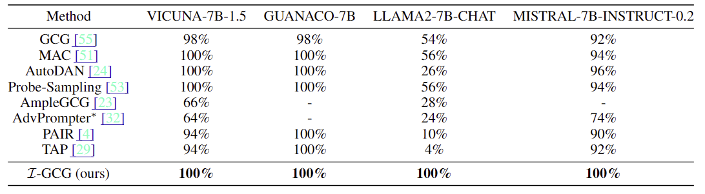
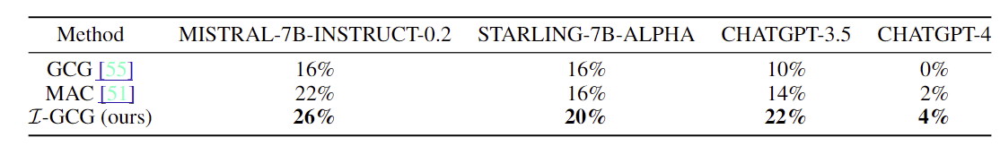

# I-GCG
The official repository for [Improved Techniques for Optimization-Based Jailbreaking on Large Language Models](https://arxiv.org/abs/2405.21018).  

Please feel free to contact jiaxiaojunqaq@gmail.com if you have any question.


## Quick Start 
### 1. Generate suffix initialization
```python
python attack_llm_core_best_update_our_target.py ----behaviors_config=behaviors_ours_config.json
```

### 2. Generate new json with the initialization
```python
python generate_our_config.py
```

### 3. Conduct jailbreaking attack
```python
python run_multiple_attack_our_target.py ----behaviors_config==behaviors_ours_config_init.json
```

## Experiments

### Comparison results with SOTA jailbreak methods

<p align="left">
    
</p>

### Transferable performance of jailbreak suffix

<p align="left">
    
</p>


## Citation

Kindly include a reference to this paper in your publications if it helps your research:
```
@article{jia2024improved,
  title={Improved Techniques for Optimization-Based Jailbreaking on Large Language Models}, 
      author={Xiaojun Jia and Tianyu Pang and Chao Du and Yihao Huang and Jindong Gu and Yang Liu and Xiaochun Cao and Min Lin},
      year={2024},
      eprint={2405.21018}
}
```


